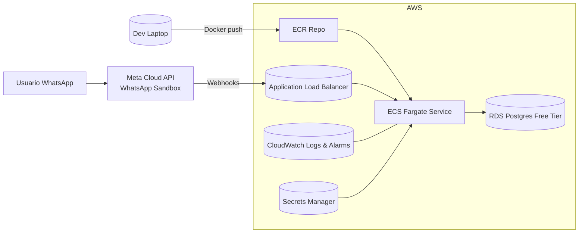

# Liora – Despliegue en AWS (Cuenta Estudiante) 🇨🇱

> Guía práctica para subir **EV‑Liora‑API** a AWS usando beneficios de estudiante, con un camino **rápido para demo** y uno **escalable para crecer**. Incluye variables de entorno, comandos, arquitectura y plan de escalado/rollback.

---

## 0) Resumen de arquitectura



**Opción A (rápida):** Elastic Beanstalk (single-container Docker) + (opcional) RDS.  
**Opción B (escalable):** ECR + ECS Fargate + ALB + RDS + Secrets Manager.

---

## 1) Requisitos previos

- **Cuenta AWS Educate / Free Tier** habilitada.
- **AWS CLI** configurado en tu equipo:
  ```bash
  pip install awscli --upgrade
  aws configure  # Access Key, Secret, region p.ej. us-east-1
  ```
- **Docker** instalado.
- Repo **ev-liora-api** con `requirements.txt` y `Dockerfile`.

---

## 2) Variables de entorno & secretos

Crea `.env` (no lo subas al repo):
```ini
FLASK_ENV=production
FLASK_APP=main.py
DATABASE_URL=sqlite:///liora.db  # cambiar a Postgres en RDS en prod
JWT_SECRET=changeme
ENCRYPTION_KEY=changeme
WABA_VERIFY_TOKEN=changeme
META_ACCESS_TOKEN=mock
BITLY_TOKEN=mock
OPENAI_API_KEY=mock
ALLOWED_ORIGINS=*
```

**Producción recomendada:**
- Guardar `JWT_SECRET`, `ENCRYPTION_KEY`, `META_ACCESS_TOKEN`, `BITLY_TOKEN`, `OPENAI_API_KEY` en **AWS Secrets Manager**.
- `DATABASE_URL` apuntando a **RDS Postgres**.

---

## 3) Contenerización

`Dockerfile` de referencia:
```dockerfile
FROM python:3.11-slim
WORKDIR /app
COPY requirements.txt .
RUN pip install -r requirements.txt
COPY . .
ENV PORT=5000 HOST=0.0.0.0
EXPOSE 5000
CMD ["flask", "run", "--host=0.0.0.0", "--port=5000"]
```

Prueba local:
```bash
docker build -t liora:dev .
docker run -p 5000:5000 --env-file .env liora:dev
```

---

## 4) Opción A — **Elastic Beanstalk** (rápida para demo)

### 4.1 Inicializar
```bash
pip install awsebcli
eb init -p docker liora-mvp --region us-east-1
```

### 4.2 Desplegar
```bash
eb create liora-env --single
# Setear variables en EB (desde consola o CLI)
eb setenv FLASK_ENV=production JWT_SECRET=... ENCRYPTION_KEY=... \
  ALLOWED_ORIGINS=* WABA_VERIFY_TOKEN=... META_ACCESS_TOKEN=... \
  BITLY_TOKEN=... OPENAI_API_KEY=... DATABASE_URL=sqlite:///liora.db
eb open
```

**RDS opcional en EB:** agrega un **RDS Postgres** a tu entorno y actualiza `DATABASE_URL`.

**Logs y salud:** `eb logs`, `eb health`.

**Ventajas:** muy rápido, ideal para demos.  
**Limitaciones:** menos control fino que ECS Fargate para escalar microservicios.

---

## 5) Opción B — **ECR + ECS Fargate** (camino escalable)

### 5.1 Crear repositorio ECR y publicar imagen
```bash
AWS_REGION=us-east-1
ACCOUNT_ID=$(aws sts get-caller-identity --query Account --output text)
aws ecr create-repository --repository-name liora --region $AWS_REGION
aws ecr get-login-password --region $AWS_REGION | docker login \
  --username AWS --password-stdin $ACCOUNT_ID.dkr.ecr.$AWS_REGION.amazonaws.com

docker tag liora:dev $ACCOUNT_ID.dkr.ecr.$AWS_REGION.amazonaws.com/liora:latest
docker push $ACCOUNT_ID.dkr.ecr.$AWS_REGION.amazonaws.com/liora:latest
```

### 5.2 RDS Postgres (Free Tier)
- Engine: **PostgreSQL** (versión libre tier).
- VPC: misma que ECS.
- Security Group: permitir puerto 5432 desde el **Security Group** del ECS Service (no desde internet).
- Tomar `endpoint`, `usuario`, `password` → construir `DATABASE_URL`:
  `postgresql://<user>:<pass>@<host>:5432/liora`

### 5.3 Secrets Manager (opcional fuerte)
- Crea un secreto JSON con:
  ```json
  {
    "JWT_SECRET": "xxx",
    "ENCRYPTION_KEY": "xxx",
    "META_ACCESS_TOKEN": "xxx",
    "BITLY_TOKEN": "xxx",
    "OPENAI_API_KEY": "xxx"
  }
  ```
- Otorga a la **Task Role** permiso `secretsmanager:GetSecretValue`.

### 5.4 Task Definition (ECS)
- **CPU/RAM:** 0.25 vCPU / 512 MB (free tier friendly).
- **Container image:** `ACCOUNT_ID.dkr.ecr.REGION.amazonaws.com/liora:latest`
- **Port mappings:** 5000 → 5000
- **Env Vars:** `FLASK_ENV`, `DATABASE_URL`, etc. (o referencia a Secrets Manager).

### 5.5 Service + ALB
- Lanza un **Fargate Service** (min 1 task).
- Crea **Application Load Balancer (ALB)**.
- **Listener 80/443**:
  - Para **HTTPS**: emite certificado en **ACM** y, si usas dominio propio, mapea en **Route 53**.
- **Health check**: `/health` (impleméntalo en Flask).

### 5.6 Seguridad
- **Security Group LB**: permitir 80/443 desde internet.
- **Security Group Service**: permitir tráfico del LB.
- **Security Group RDS**: permitir tráfico **solo** desde el SG del Service (puerto 5432).

---

## 6) Migraciones & Datos

**Alembic** (recomendado):
```bash
alembic init migrations
alembic revision -m "init schema" --autogenerate
alembic upgrade head
```

Seeds mínimos:
- Cliente Demo, Usuario Owner, WABA sandbox/mock.

---

## 7) WhatsApp Sandbox (Meta Cloud)

1. Crea app en **Meta for Developers** y habilita **WhatsApp Sandbox**.
2. Configura **Webhook URL**:
   - `https://<tu-alb-o-eb-domain>/webhook/meta`
3. `GET /webhook/meta` debe responder el **challenge** (usa `WABA_VERIFY_TOKEN`).
4. `POST /webhook/meta`: valida firma HMAC y enruta al **router de Liora**.

---

## 8) Observabilidad, Backups y Costos

- **Logs:** CloudWatch (ECS/EB) → crea filtros de errores/latencia.
- **Alarms:** 5xx en ALB, CPU > 70%, memoria > 80%.
- **Backups RDS:** diarias, retención 7–14 días.
- **Costos (orientativo free tier):**
  - ECS Fargate 1 task 0.25 vCPU/512MB con bajo tráfico ≈ muy bajo costo bajo créditos.
  - RDS t4g.micro (Free Tier): cubierto parcial por créditos.
  - Secrets Manager: costo por secreto/10000 llamadas (mínimo).

---

## 9) Escalado, Despliegue Azul/Verde y Rollback

- **Escalado (ECS):** Auto Scaling por CPU/requests; incrementa `desiredCount`.
- **Blue/Green:** crea un **nuevo Task Definition revision** y actualiza el Service con minimum/maximum healthy percent (p.ej., 50/200).
- **Rollback:** vuelve a la **Task Definition revision** previa si el health check falla.
- **EB:** soporta rolling/immutable updates; rollback desde consola.

---

## 10) Checklist de validación (MVP)

- [ ] Health check `GET /health` **200 OK** en ALB/EB.
- [ ] `GET /webhook/meta` responde challenge.
- [ ] `POST /webhook/meta` recibe evento y escribe en **ConversationLog**.
- [ ] `POST /clientes/{id}/catalog/publish` activa **CatalogActive**.
- [ ] Skill **Ecommerce** devuelve links (idealmente con **Bitly**).
- [ ] Skill **Vida Sana** responde prompts base.
- [ ] Logs visibles en CloudWatch; métricas básicas con alarmas.

---

## 11) Snippets útiles (CLI)

### 11.1 Exportar URL del ALB (ECS)
```bash
aws elbv2 describe-load-balancers --names liora-alb \
  --query 'LoadBalancers[0].DNSName' --output text
```

### 11.2 Setear env vars en EB
```bash
eb setenv FLASK_ENV=production DATABASE_URL=postgresql://... JWT_SECRET=... \
ENCRYPTION_KEY=... WABA_VERIFY_TOKEN=... META_ACCESS_TOKEN=... BITLY_TOKEN=... \
OPENAI_API_KEY=... ALLOWED_ORIGINS=*
```

### 11.3 Política mínima (Task Role) para Secrets Manager
```json
{
  "Version": "2012-10-17",
  "Statement": [
    {
      "Effect": "Allow",
      "Action": ["secretsmanager:GetSecretValue"],
      "Resource": ["arn:aws:secretsmanager:REGION:ACCOUNT_ID:secret:liora/*"]
    }
  ]
}
```

---

## 12) Buenas prácticas

- **No** exponer `DATABASE_URL` con password en logs.
- Activar **HTTPS** (ACM + ALB/EB) para webhooks.
- Rotar tokens (Meta/Bitly/OpenAI) regularmente.
- Pruebas unitarias básicas (e.g., `catalog_service`, `meta_webhook_controller`).

---

### Apéndice A – Endpoints a tener listos
- `GET /health` → 200 OK (para ALB/EB).
- `GET /webhook/meta` → verify.
- `POST /webhook/meta` → events.
- `POST /clientes/{id}/catalog/publish` → snapshots/activo.
- (Opc.) `GET /clientes/{id}/logs` → auditoría básica.

---

> Con esta guía puedes partir con **EB (rápido)** y migrar a **ECS Fargate (escalable)** sin rehacer la app. Deja las **credenciales en Secrets Manager**, la **DB en RDS** y usa **CloudWatch** para ver cómo respira Liora.
