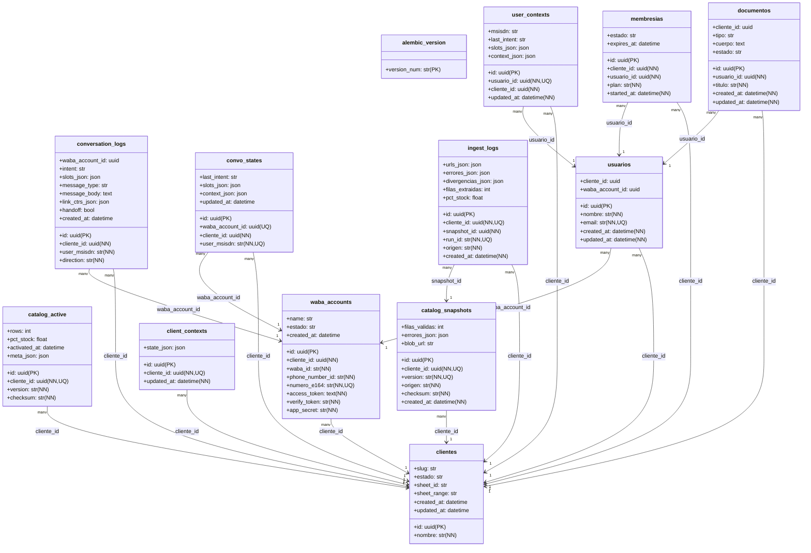

# BDD — Diagrama (autogenerado)

```mermaid
classDiagram
  class alembic_version {
    +version_num: str (PK)
  }
  class catalog_active {
    +id: uuid (PK)
    +cliente_id: uuid (NN,UQ)
    +version: str (NN)
    +checksum: str (NN)
    +rows: int
    +pct_stock: float
    +activated_at: datetime
    +meta_json: json
  }
  class catalog_snapshots {
    +id: uuid (PK)
    +cliente_id: uuid (NN,UQ)
    +version: str (NN,UQ)
    +origen: str (NN)
    +checksum: str (NN)
    +filas_validas: int
    +errores_json: json
    +created_at: datetime (NN)
    +blob_url: str
  }
  class client_contexts {
    +id: uuid (PK)
    +cliente_id: uuid (NN,UQ)
    +state_json: json
    +updated_at: datetime (NN)
  }
  class clientes {
    +id: uuid (PK)
    +nombre: str (NN)
    +slug: str
    +estado: str
    +sheet_id: str
    +sheet_range: str
    +created_at: datetime
    +updated_at: datetime
  }
  class conversation_logs {
    +id: uuid (PK)
    +cliente_id: uuid (NN)
    +waba_account_id: uuid
    +user_msisdn: str (NN)
    +direction: str (NN)
    +intent: str
    +slots_json: json
    +message_type: str
    +message_body: text
    +link_ctrs_json: json
    +handoff: bool
    +created_at: datetime
  }
  class convo_states {
    +id: uuid (PK)
    +waba_account_id: uuid (UQ)
    +cliente_id: uuid (NN)
    +user_msisdn: str (NN,UQ)
    +last_intent: str
    +slots_json: json
    +context_json: json
    +updated_at: datetime
  }
  class documentos {
    +id: uuid (PK)
    +cliente_id: uuid
    +usuario_id: uuid (NN)
    +titulo: str (NN)
    +tipo: str
    +cuerpo: text
    +estado: str
    +created_at: datetime (NN)
    +updated_at: datetime (NN)
  }
  class ingest_logs {
    +id: uuid (PK)
    +cliente_id: uuid (NN,UQ)
    +snapshot_id: uuid (NN)
    +run_id: str (NN,UQ)
    +origen: str (NN)
    +urls_json: json
    +errores_json: json
    +divergencias_json: json
    +filas_extraidas: int
    +pct_stock: float
    +created_at: datetime (NN)
  }
  class membresias {
    +id: uuid (PK)
    +cliente_id: uuid (NN)
    +usuario_id: uuid (NN)
    +plan: str (NN)
    +estado: str
    +started_at: datetime (NN)
    +expires_at: datetime
  }
  class user_contexts {
    +id: uuid (PK)
    +usuario_id: uuid (NN,UQ)
    +cliente_id: uuid (NN)
    +msisdn: str
    +last_intent: str
    +slots_json: json
    +context_json: json
    +updated_at: datetime (NN)
  }
  class usuarios {
    +id: uuid (PK)
    +nombre: str (NN)
    +email: str (NN,UQ)
    +cliente_id: uuid
    +waba_account_id: uuid
    +created_at: datetime (NN)
    +updated_at: datetime (NN)
  }
  class waba_accounts {
    +id: uuid (PK)
    +cliente_id: uuid (NN)
    +name: str
    +waba_id: str (NN)
    +phone_number_id: str (NN)
    +numero_e164: str (NN,UQ)
    +access_token: text (NN)
    +verify_token: str (NN)
    +app_secret: str (NN)
    +estado: str
    +created_at: datetime
  }
  catalog_active "many" --> "1" clientes : cliente_id
  catalog_snapshots "many" --> "1" clientes : cliente_id
  client_contexts "many" --> "1" clientes : cliente_id
  conversation_logs "many" --> "1" clientes : cliente_id
  conversation_logs "many" --> "1" waba_accounts : waba_account_id
  convo_states "many" --> "1" clientes : cliente_id
  convo_states "many" --> "1" waba_accounts : waba_account_id
  documentos "many" --> "1" clientes : cliente_id
  documentos "many" --> "1" usuarios : usuario_id
  ingest_logs "many" --> "1" clientes : cliente_id
  ingest_logs "many" --> "1" catalog_snapshots : snapshot_id
  membresias "many" --> "1" clientes : cliente_id
  membresias "many" --> "1" usuarios : usuario_id
  user_contexts "many" --> "1" clientes : cliente_id
  user_contexts "many" --> "1" usuarios : usuario_id
  usuarios "many" --> "1" clientes : cliente_id
  usuarios "many" --> "1" waba_accounts : waba_account_id
  waba_accounts "many" --> "1" clientes : cliente_id
```

_Generado: 2025-08-20T21:25:52.625580Z_
