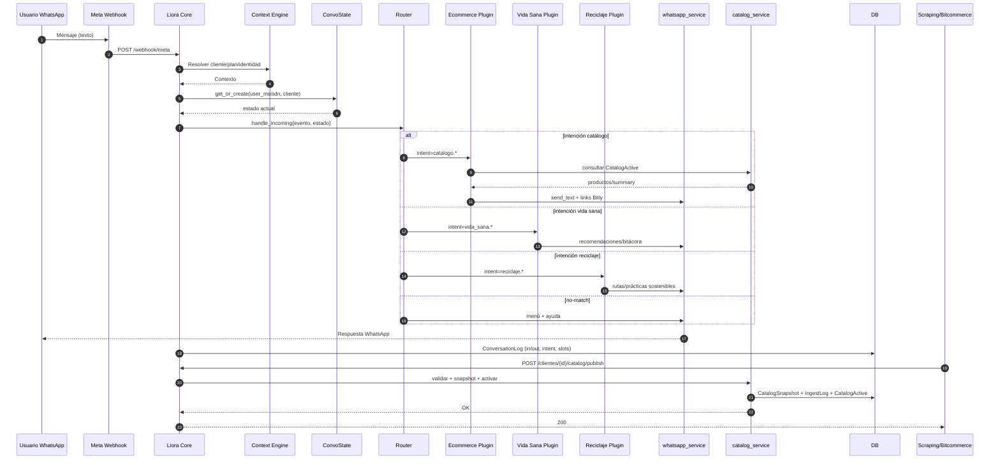

# Liora – Flujos principales (Conversación e Ingesta)

## Notas de flujo

**Q&A desde CSV (Drive)**  
1) Cliente realiza request HTTP a `chat_controller.responder_pregunta`.  
2) Controlador usa `drive_csv_service` para cargar CSV (fileId/URL o carpeta+archivo).  
3) Transforma filas → `EntradaChat` y llama `find_answer`.  
4) Devuelve respuesta JSON; registra evento en `ConversationLog` (si aplica).
