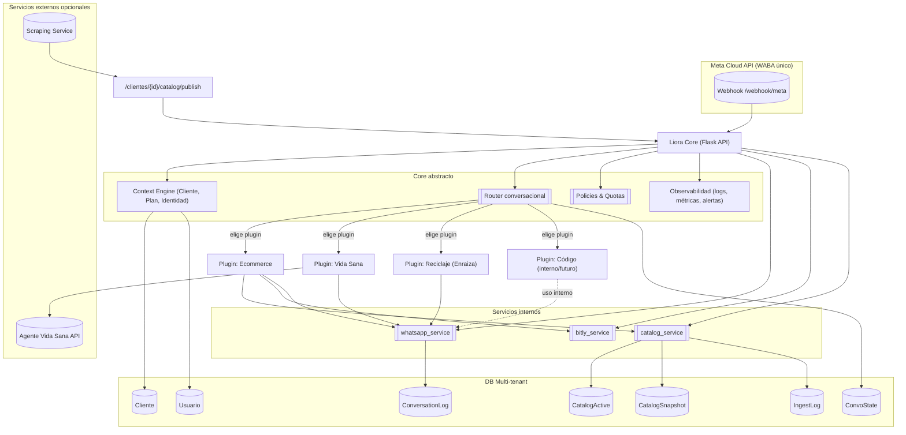

# Liora – Visión (alto nivel)

```mermaid
graph TD
  subgraph Meta["Meta Cloud API (WABA único)"]
    MWebhook[(Webhook /webhook/meta)]
  end

  MWebhook --> LCore["Liora Core (Flask API)"]

  subgraph Core["Core abstracto"]
    Router[[Router conversacional]]
    Context["Context Engine (Cliente, Plan, Identidad)"]
    Policy[[Policies & Quotas]]
    Obs["Observabilidad (logs, métricas, alertas)"]
  end

  LCore --> Context
  LCore --> Router
  LCore --> Policy
  LCore --> Obs

  Router -->|elige plugin| PL_Ecomm["Plugin: Ecommerce"]
  Router -->|elige plugin| PL_Vida["Plugin: Vida Sana"]
  Router -->|elige plugin| PL_Rec["Plugin: Reciclaje (Enraiza)"]
  Router -->|elige plugin| PL_Code["Plugin: Código (interno/futuro)"]

  subgraph Services["Servicios internos"]
    WSvc[[whatsapp_service]]
    Bitly[[bitly_service]]
    CatSvc[[catalog_service]]
  end

  LCore --> WSvc
  LCore --> Bitly
  LCore --> CatSvc

  PL_Ecomm --> CatSvc
  PL_Ecomm --> Bitly
  PL_Ecomm --> WSvc

  PL_Vida --> WSvc
  PL_Rec --> WSvc
  PL_Code -. uso interno .-> WSvc

  subgraph Ext["Servicios externos opcionales"]
    Scraper[(Scraping Service)]
    VidaAPI[(Agente Vida Sana API)]
  end

  Endpoint["/clientes/{id}/catalog/publish"]
  Scraper --> Endpoint --> LCore

  PL_Vida --> VidaAPI

  subgraph DB["DB Multi-tenant"]
    Cliente[(Cliente)]
    Usuario[(Usuario)]
    Convo[(ConvoState)]
    CActive[(CatalogActive)]
    CSnap[(CatalogSnapshot)]
    Ingest[(IngestLog)]
    CLog[(ConversationLog)]
  end

  Context --> Cliente
  Context --> Usuario
  Router --> Convo
  CatSvc --> CActive
  CatSvc --> CSnap
  CatSvc --> Ingest
  WSvc --> CLog
```
