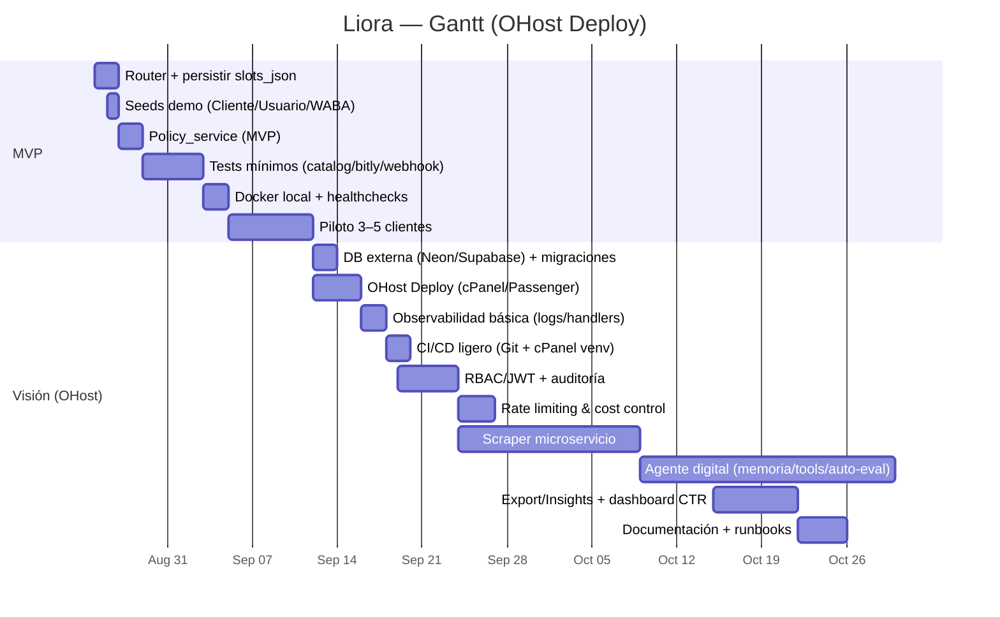

# Gantt — Liora (OHost Deploy)

```mermaid
gantt
    title Liora — Gantt (OHost Deploy)
    dateFormat  YYYY-MM-DD
    axisFormat  %b %d
    section MVP
    Router + persistir slots_json :core, 2025-08-25, 2d
    Seeds demo (Cliente/Usuario/WABA) :core, 2025-08-26, 1d
    Policy_service (MVP) :core, 2025-08-27, 2d
    Tests mínimos (catalog/bitly/webhook) :qa, 2025-08-29, 5d
    Docker local + healthchecks :devops, 2025-09-03, 2d
    Piloto 3–5 clientes :producto, 2025-09-05, 7d
    section Visión (OHost)
    DB externa (Neon/Supabase) + migraciones :core, 2025-09-12, 2d
    OHost Deploy (cPanel/Passenger) :devops, 2025-09-12, 4d
    Observabilidad básica (logs/handlers) :devops, 2025-09-16, 2d
    CI/CD ligero (Git + cPanel venv) :devops, 2025-09-18, 2d
    RBAC/JWT + auditoría :core, 2025-09-19, 5d
    Rate limiting & cost control :core, 2025-09-24, 3d
    Scraper microservicio :integrations, 2025-09-24, 15d
    Agente digital (memoria/tools/auto-eval) :ai, 2025-10-09, 21d
    Export/Insights + dashboard CTR :producto, 2025-10-15, 7d
    Documentación + runbooks :opsdev, 2025-10-22, 4d
```
